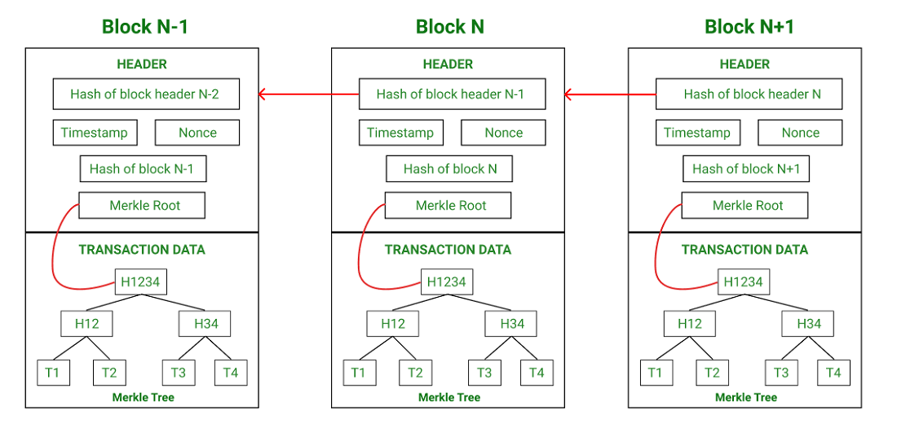

## Overview

This suite contains three distinct simulations:

1.  **`blockchain_simulation.js`**: Illustrates the fundamental structure of a blockchain. You'll see how blocks are cryptographically linked and how tampering with one block can invalidate the entire chain.
2.  **`mining_simulation.js`**: Focuses on the Proof-of-Work (PoW) mining process. This script simulates the computational effort required to find a valid "nonce" that meets a predefined difficulty target, securing a block.
3.  **`consensus_demo.js`**: Explores and contrasts three common consensus algorithms: Proof-of-Work (PoW), Proof-of-Stake (PoS), and Delegated Proof-of-Stake (DPoS). It shows how each mechanism selects a validator or delegate to propose the next block.

## Getting Started

### Prerequisites

*   **Node.js**: Ensure you have Node.js installed. You can download it from [nodejs.org](https://nodejs.org/).
*   **`crypto-js` Library**: This project uses `crypto-js` for SHA-256 hashing. Install it by navigating to the project directory (`e:\blockchain`) in your terminal and running:

    ```bash
    npm install crypto-js
    ```

### Running the Simulations

Execute each simulation script using Node.js from the `e:\blockchain` directory:

1.  **Blockchain Simulation (`blockchain_simulation.js`)**

    ```bash
    node blockchain_simulation.js
    ```

    *   **What to Expect**: The console will output the process of mining blocks, display the full blockchain structure, and confirm its validity. A commented-out section within the code allows you to simulate data tampering and observe its consequences on chain integrity.
        **Example Output:**
        ```text
        --- Blockchain Simulation ---
        Mining block 1...
        Block 1 mined: 0034dcc6ecb388befd950e67a27d845e7921da4c9f78b7b5cb0cee96030412c8
        Nonce attempts: 384
        Time taken to mine: 0.014 seconds
        Mining block 2...
        Block 2 mined: 00faa01450ffdc30c5e94c971926b1e4fbb9d4fc5f0e6fc8303224013156f117
        Nonce attempts: 23
        Time taken to mine: 0.001 seconds
        Mining block 3...
        Block 3 mined: 000dea332841a84d22831ee334a6d4dd7afa7ecdf65bad27f5fd279eb056fd8e
        Nonce attempts: 31
        Time taken to mine: 0 seconds

        Blockchain complete:
        [
          {
            "index": 0,
            "timestamp": "6/8/2025, 5:21:29 PM",
            "data": "Genesis block",
            "previousHash": "0",
            "nonce": 0,
            "hash": "2dbd6206e58386343987387474c6915fface385e53765302f7840d045b18fec3"
          },
          {
            "index": 1,
            "timestamp": "6/8/2025, 5:21:29 PM",
            "data": {
              "amount": 10,
              "from": "Alice",
              "to": "Bob"
            },
            "previousHash": "2dbd6206e58386343987387474c6915fface385e53765302f7840d045b18fec3",
            "nonce": 384,
            "hash": "0034dcc6ecb388befd950e67a27d845e7921da4c9f78b7b5cb0cee96030412c8"
          },
          {
            "index": 2,
            "timestamp": "6/8/2025, 5:21:29 PM",
            "data": {
              "amount": 25,
              "from": "Bob",
              "to": "Charlie"
            },
            "previousHash": "0034dcc6ecb388befd950e67a27d845e7921da4c9f78b7b5cb0cee96030412c8",
            "nonce": 23,
            "hash": "00faa01450ffdc30c5e94c971926b1e4fbb9d4fc5f0e6fc8303224013156f117"
          },
          {
            "index": 3,
            "timestamp": "6/8/2025, 5:21:29 PM",
            "data": {
              "amount": 5,
              "from": "Charlie",
              "to": "Alice"
            },
            "previousHash": "00faa01450ffdc30c5e94c971926b1e4fbb9d4fc5f0e6fc8303224013156f117",
            "nonce": 31,
            "hash": "000dea332841a84d22831ee334a6d4dd7afa7ecdf65bad27f5fd279eb056fd8e"
          }
        ]

        Is blockchain valid? true
        ```
    *   **Tampering Example Output**:
        To see the tampering detection in action, you need to uncomment the section labeled `// --- Tampering Example (Uncomment to see invalidation) ---` in `blockchain_simulation.js` and re-run the script. 

        **Expected Output for Tampering Example:**
        ```text
        --- Blockchain Simulation ---
        Mining block 1...
        Block 1 mined: 0034dcc6ecb388befd950e67a27d845e7921da4c9f78b7b5cb0cee96030412c8
        Nonce attempts: 384
        Time taken to mine: 0.014 seconds
        Mining block 2...
        Block 2 mined: 00faa01450ffdc30c5e94c971926b1e4fbb9d4fc5f0e6fc8303224013156f117
        Nonce attempts: 23
        Time taken to mine: 0.001 seconds
        Mining block 3...
        Block 3 mined: 000dea332841a84d22831ee334a6d4dd7afa7ecdf65bad27f5fd279eb056fd8e
        Nonce attempts: 31
        Time taken to mine: 0 seconds

        Blockchain complete:
        [
        {
            "index": 0,
            "timestamp": "6/8/2025, 5:21:29 PM",
            "data": "Genesis block",
            "previousHash": "0",
            "nonce": 0,
            "hash": "2dbd6206e58386343987387474c6915fface385e53765302f7840d045b18fec3"
        },
        {
            "index": 1,
            "timestamp": "6/8/2025, 5:21:29 PM",
            "data": {
            "amount": 10,
            "from": "Alice",
            "to": "Bob"
            },
            "previousHash": "2dbd6206e58386343987387474c6915fface385e53765302f7840d045b18fec3",
            "nonce": 384,
            "hash": "0034dcc6ecb388befd950e67a27d845e7921da4c9f78b7b5cb0cee96030412c8"
        },
        {
            "index": 2,
            "timestamp": "6/8/2025, 5:21:29 PM",
            "data": {
            "amount": 25,
            "from": "Bob",
            "to": "Charlie"
            },
            "previousHash": "0034dcc6ecb388befd950e67a27d845e7921da4c9f78b7b5cb0cee96030412c8",
            "nonce": 23,
            "hash": "00faa01450ffdc30c5e94c971926b1e4fbb9d4fc5f0e6fc8303224013156f117"
        },
        {
            "index": 3,
            "timestamp": "6/8/2025, 5:21:29 PM",
            "data": {
            "amount": 5,
            "from": "Charlie",
            "to": "Alice"
            },
            "previousHash": "00faa01450ffdc30c5e94c971926b1e4fbb9d4fc5f0e6fc8303224013156f117",
            "nonce": 31,
            "hash": "000dea332841a84d22831ee334a6d4dd7afa7ecdf65bad27f5fd279eb056fd8e"
        }
        ]

        Is blockchain valid? true

        Attempting to tamper with Block 1...
        Block 2 does not point to the correct previous hash!
        Is blockchain valid after tampering? false

        ```
        **Explanation of Tampering Output:**
        1.  `Attempting to tamper with Block 1...`: This message indicates that the script is now executing the tampering code.
        2.  `myBlockchain.chain[1].data = { amount: 1000, from: "Alice", to: "Bob" };`: The data in the second block (index 1) is changed. Its original amount was 10, and now it's 1000.
        3.  `myBlockchain.chain[1].hash = myBlockchain.chain[1].calculateHash();`: The hash of the tampered block is recalculated. **Crucially, this only updates the hash of Block 1.** In a real, secure blockchain, this isn't enough. The `previousHash` of Block 2 (which points to Block 1's original hash) is now incorrect, and Block 1 itself would need to be re-mined to be valid if this were a live system.
        4.  `Block 2 hash is invalid!`: When `isChainValid()` is called, it iterates through the chain. 
            *   It first checks Block 1: `currentBlock.hash === currentBlock.calculateHash()`. This will be true because we manually recalculated and updated Block 1's hash after changing its data.
            *   Then it checks Block 2: `currentBlock.previousHash === previousBlock.hash`. Here, `currentBlock` is Block 2, and `previousBlock` is the (now tampered) Block 1. Block 2's `previousHash` field still holds the *original* hash of Block 1 (before tampering and recalculation). However, Block 1's `hash` field now holds the *new* hash (calculated after its data was changed). Since these two hash values no longer match, the chain's integrity check fails at this point. The `isChainValid()` function logs this message and returns `false`.
        5.  `Is blockchain valid after tampering? false`: This confirms that the blockchain is no longer considered valid due to the detected inconsistency.

2.  **Nonce Mining Simulation (`mining_simulation.js`)**

    ```bash
    node mining_simulation.js
    ```

    *   **What to Expect**: This script will show the mining process in action, including the difficulty target, the discovered nonce, the resulting block hash, and a verification of the hash's validity.
        **Example Output:**
        ```text
        --- Mining Simulation ---
        Mining for a hash starting with '000' (Difficulty: 3)...
        Found nonce: 1913
        Resulting hash: 000565b3e8c340a563b50a27321c83265a118996cc7bc428ab5330a3996f83b4

        Mining complete for data: "My first block data!"
        Nonce found: 1913
        Final Hash: 000565b3e8c340a563b50a27321c83265a118996cc7bc428ab5330a3996f83b4
        Verification: Does hash start with 3 zeros? true
        ```

3.  **Consensus Mechanism Simulation (`consensus_demo.js`)**

    ```bash
    node consensus_demo.js
    ```

    *   **What to Expect**: The output will detail the selection process for a validator or delegate under PoW, PoS, and DPoS rules. Each section includes an explanation of the underlying logic. Due to the use of random values for power, stake, and votes, the selected entities may differ on each run.
        **Example Output:**
        ```text
        --- Consensus Mechanism Simulation Results ---

        --- Proof of Work (PoW) ---
        Simulating PoW: Selecting validator based on computational 'power'.
        Miner ID: miner_alpha, Power: 560
        Selected Validator for PoW: miner_alpha (Power: 560)
        Explanation: In Proof of Work, validators (miners) compete by using their computational power to solve a cryptographic puzzle. The first miner to find the solution gets the right to add the next block to the blockchain and is rewarded. This mechanism prioritizes computational contribution and energy expenditure for security.

        --- Proof of Stake (PoS) ---
        Simulating PoS: Selecting validator with highest 'stake'.
        Staker ID: staker_one, Stake: 3862
        Staker ID: staker_two, Stake: 4905
        Staker ID: staker_three, Stake: 8805
        Staker ID: staker_four, Stake: 1835
        Staker ID: staker_five, Stake: 2165
        Selected Validator for PoS: staker_three (Stake: 8805)
        Explanation: In Proof of Stake, validators are chosen to create new blocks based on the amount of cryptocurrency they have 'staked' (locked up) as collateral. The more stake a validator commits, the higher their chance of being selected to validate transactions and earn rewards. This mechanism aims to be more energy-efficient than PoW.

        --- Delegated Proof of Stake (DPoS) ---
        Simulating DPoS: Randomly choosing a delegate based on their accumulated votes.
        Delegate ID: delegate_A, Votes: 92
        Delegate ID: delegate_B, Votes: 60
        Delegate ID: delegate_C, Votes: 32
        Delegate ID: delegate_D, Votes: 122
        Delegate ID: delegate_E, Votes: 62
        Selected Delegate for DPoS: delegate_E (Votes: 62)
        Explanation: In DPoS, token holders 'delegate' their voting power to elect a set of delegates (or witnesses/block producers). These elected delegates are then responsible for validating transactions and producing blocks. The chance of a delegate being selected to create a block is proportional to the total votes they received. This mechanism aims for faster transaction times and greater scalability compared to PoW and PoS, as there are fewer validators.

        --- End of Simulation ---
        ```

## Learning Objectives

By running these simulations, you can gain a practical understanding of:

*   How blocks are created and linked using cryptographic hashes.
*   The concept of immutability in blockchains and how tampering is detected.
*   The role of the nonce and difficulty in Proof-of-Work mining.
*   The basic decision-making logic behind PoW, PoS, and DPoS consensus mechanisms.

## Customization

Feel free to modify the parameters within the scripts, such as:

*   **Difficulty Levels**: Adjust the `difficulty` variable in `blockchain_simulation.js` and `mining_simulation.js` to see how it impacts mining time and the number of nonce attempts.
*   **Transaction Data**: Change the data within blocks in `blockchain_simulation.js`.
*   **Validator Attributes**: Modify the `power`, `stake`, or `votingPower` values in `consensus_demo.js` to observe different selection outcomes.

Enjoy exploring these blockchain fundamentals!

---

## Theoretical Part: Answers

### Blockchain Basics

**Define blockchain in your own words (100–150 words).**

A blockchain, in essence, is a continuously growing list of records, called blocks, that are securely linked together using cryptography. Each block typically contains a cryptographic hash of the previous block, a timestamp, and transaction data. This design makes blockchains inherently resistant to modification of their data. Once a block is added to the chain, it cannot be altered retroactively without redoing all subsequent blocks, which would require an immense amount of computational power and collusion. This creates a transparent, auditable, and immutable ledger, often distributed across a network of computers, making it decentralized and robust against single points of failure or control. It's like a shared digital notebook where every entry is permanent and visible to everyone involved.

**List 2 real-life use cases (e.g., supply chain, digital identity).**

1.  **Supply Chain Management:** Blockchain can provide an immutable and transparent record of a product's journey from origin to consumer. Each step (e.g., sourcing, manufacturing, shipping, retail) can be recorded as a transaction on the blockchain. This enhances traceability, helps verify authenticity, reduces fraud (like counterfeiting), and improves efficiency by providing all stakeholders with a shared, trusted view of the supply chain.
2.  **Digital Identity:** Blockchain can empower individuals with self-sovereign identity. Instead of relying on centralized authorities to manage and verify personal data, users can control their own identity information, storing attestations and credentials securely on a blockchain. They can then grant selective access to verifiers as needed, enhancing privacy, reducing identity theft, and simplifying verification processes across various services.

### Block Anatomy

**Draw a block showing: data, previous hash, timestamp, nonce, and Merkle root.**



**Briefly explain with an example how the Merkle root helps verify data integrity.**

A Merkle root is a single hash that summarizes all transactions within a block. It's created by repeatedly hashing pairs of transaction hashes together until only one hash remains – the root. For example, if a block has four transactions (T1, T2, T3, T4), we first hash them individually: H1=hash(T1), H2=hash(T2), H3=hash(T3), H4=hash(T4). Then, we hash pairs: H12=hash(H1+H2), H34=hash(H3+H4). Finally, the Merkle root is M=hash(H12+H34).

If someone wants to verify if T2 is part of the block and hasn't been tampered with, they don't need all transactions. They only need T2, H1, and H34 (the "Merkle path"). They can recalculate H12 by hashing H1 with hash(T2), and then hash the result with H34. If this final hash matches the block's stored Merkle root, T2's integrity and inclusion are verified efficiently without processing all block data.

### Consensus Conceptualization

**Explain in brief (4–5 sentences each):**

*   **What is Proof of Work and why does it require energy?**
    Proof of Work (PoW) is a consensus mechanism where participants, called miners, compete to solve a complex mathematical puzzle. The first miner to solve it gets to add the next block of transactions to the blockchain and is rewarded. This puzzle-solving requires significant computational power, as miners try countless random inputs (nonces) until they find one that produces a hash meeting specific criteria. This intense computation consumes a large amount of electrical energy, which serves as a deterrent against malicious actors (as attacking the network would be prohibitively expensive) and ensures the network's security and integrity.

*   **What is Proof of Stake and how does it differ?**
    Proof of Stake (PoS) is a consensus mechanism where block creators (validators) are chosen based on the number of coins they hold and are willing to "stake" as collateral. Instead of competing with computational power, validators are typically selected pseudo-randomly, with their chances of being chosen proportional to their stake. If a validator approves fraudulent transactions, they risk losing their staked coins. PoS differs from PoW primarily in its energy consumption; it's significantly more energy-efficient as it doesn't require intensive computations, relying instead on economic incentives tied to the staked capital.

*   **What is Delegated Proof of Stake and how are validators selected?**
    Delegated Proof of Stake (DPoS) is a variation of PoS where coin holders vote for a limited number of delegates (also known as witnesses or block producers) to secure the network on their behalf. These elected delegates are responsible for validating transactions and creating new blocks. The voting power of a coin holder is typically proportional to their stake. Validators (delegates) are selected based on the outcome of these ongoing elections; those who receive the most votes become the active block producers. This system aims to combine the efficiency of PoS with faster transaction speeds and more democratic governance.